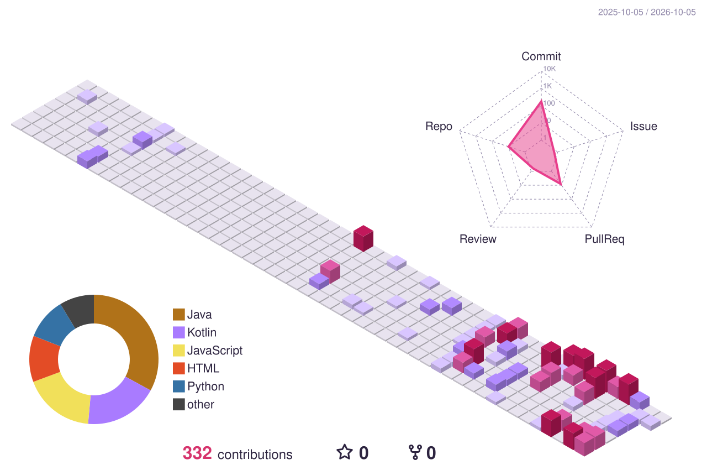

<picture>
  <source media="(prefers-color-scheme: dark)" srcset="assets/header-dark.svg">
  <source media="(prefers-color-scheme: light)" srcset="assets/header-light.svg">
  
</picture>

  <picture>
    <source media="(prefers-color-scheme: dark)" srcset="https://readme-typing-svg.demolab.com?font=JetBrains+Mono&weight=500&size=22&duration=2800&pause=1200&color=FF6FAE&center=true&vCenter=true&width=560&lines=Mobile+%26+Backend+Developer;GameDev+Enthusiast;Data+Analysis+Explorer">
    <source media="(prefers-color-scheme: light)" srcset="https://readme-typing-svg.demolab.com?font=JetBrains+Mono&weight=500&size=22&duration=2800&pause=1200&color=D6336C&center=true&vCenter=true&width=560&lines=Mobile+%26+Backend+Developer;GameDev+Enthusiast;Data+Analysis+Explorer">
    
  </picture>

## 💎 Обо мне

- 📱 Разрабатываю мобильные приложения и бэкенд: **Kotlin**, **Java**, **Spring**
- 🎮 Увлекаюсь геймдевом: **Unity** и **Unreal Engine**
- 📈 Погружаюсь в анализ данных
- 🐳 Упаковываю сервисы в **Docker**

## 🛠️ Технологии

  <picture>
    <source media="(prefers-color-scheme: dark)" srcset="https://skillicons.dev/icons?i=kotlin,java,spring,docker,unity,unreal,js,ts,html&theme=dark">
    <source media="(prefers-color-scheme: light)" srcset="https://skillicons.dev/icons?i=kotlin,java,spring,docker,unity,unreal,js,ts,html&theme=light">
    
  </picture>

## 📊 Статистика

  <picture>
    <source media="(prefers-color-scheme: dark)" srcset="https://github-readme-stats.vercel.app/api?username=quartz-code&locale=ru&custom_title=%D0%A1%D1%82%D0%B0%D1%82%D0%B8%D1%81%D1%82%D0%B8%D0%BA%D0%B0%20GitHub&show_icons=true&rank_icon=github&include_all_commits=true&hide=contribs&show=prs_merged&card_width=495&border_radius=14&bg_color=135,1c1132,120b22&title_color=ff6fae&icon_color=c084fc&text_color=d9d0ee&ring_color=ff6fae&border_color=2a2340">
    <source media="(prefers-color-scheme: light)" srcset="https://github-readme-stats.vercel.app/api?username=quartz-code&locale=ru&custom_title=%D0%A1%D1%82%D0%B0%D1%82%D0%B8%D1%81%D1%82%D0%B8%D0%BA%D0%B0%20GitHub&show_icons=true&rank_icon=github&include_all_commits=true&hide=contribs&show=prs_merged&card_width=495&border_radius=14&bg_color=135,fff7fb,f3ecff&title_color=d6336c&icon_color=8b5cf6&text_color=4f4566&ring_color=e83e8c&border_color=ebe1fa">
    
  </picture>
  <picture>
    <source media="(prefers-color-scheme: dark)" srcset="https://streak-stats.demolab.com/?user=quartz-code&locale=ru&border_radius=14&background=135,1C1132,120B22&border=2A2340&stroke=3A2F55&ring=FF6FAE&fire=FF6FAE&currStreakNum=FFFFFF&sideNums=FF8FC5&currStreakLabel=FF8FC5&sideLabels=D9D0EE&dates=9C93B5">
    <source media="(prefers-color-scheme: light)" srcset="https://streak-stats.demolab.com/?user=quartz-code&locale=ru&border_radius=14&background=135,FFF7FB,F3ECFF&border=EBE1FA&stroke=E2D6F7&ring=E83E8C&fire=E83E8C&currStreakNum=2D2440&sideNums=D6336C&currStreakLabel=D6336C&sideLabels=4F4566&dates=8F86A8">
    
  </picture>

## 🔮 Моя активность

<picture>
  <source media="(prefers-color-scheme: dark)" srcset="profile-3d-contrib/profile-quartz-dark.svg">
  <source media="(prefers-color-scheme: light)" srcset="profile-3d-contrib/profile-quartz-light.svg">
  
</picture>

<picture>
  <source media="(prefers-color-scheme: dark)" srcset="https://raw.githubusercontent.com/quartz-code/quartz-code/output/github-contribution-grid-snake-dark.svg">
  <source media="(prefers-color-scheme: light)" srcset="https://raw.githubusercontent.com/quartz-code/quartz-code/output/github-contribution-grid-snake.svg">
  
</picture>

<picture>
  <source media="(prefers-color-scheme: dark)" srcset="assets/footer-dark.svg">
  <source media="(prefers-color-scheme: light)" srcset="assets/footer-light.svg">
  
</picture>
