  <picture>
    <source media="(prefers-color-scheme: dark)" srcset="assets/hero-dark.svg">
    <source media="(prefers-color-scheme: light)" srcset="assets/hero-light.svg">
    
  </picture>

  <picture>
    <source media="(prefers-color-scheme: dark)" srcset="assets/passport-dark.svg">
    <source media="(prefers-color-scheme: light)" srcset="assets/passport-light.svg">
    
  </picture>

  <picture>
    <source media="(prefers-color-scheme: dark)" srcset="assets/stack-dark.svg">
    <source media="(prefers-color-scheme: light)" srcset="assets/stack-light.svg">
    
  </picture>

  <picture>
    <source media="(prefers-color-scheme: dark)" srcset="assets/druse-dark.svg">
    <source media="(prefers-color-scheme: light)" srcset="assets/druse-light.svg">
    
  </picture>

